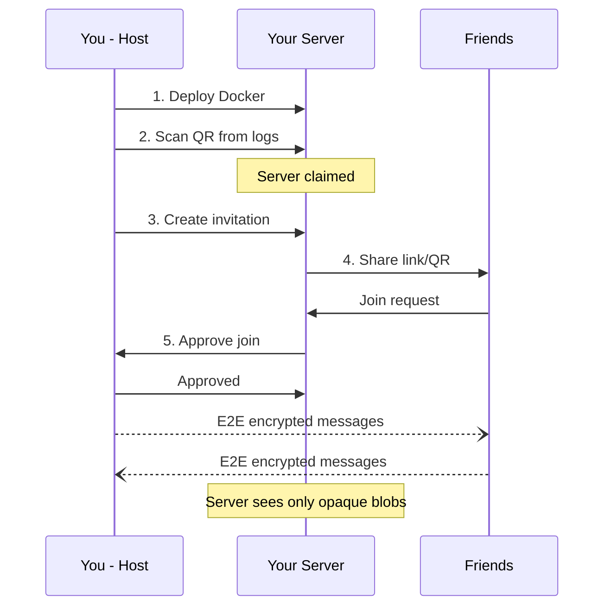
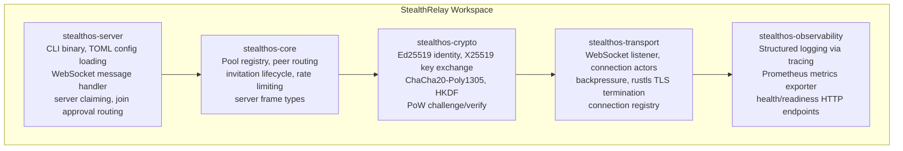
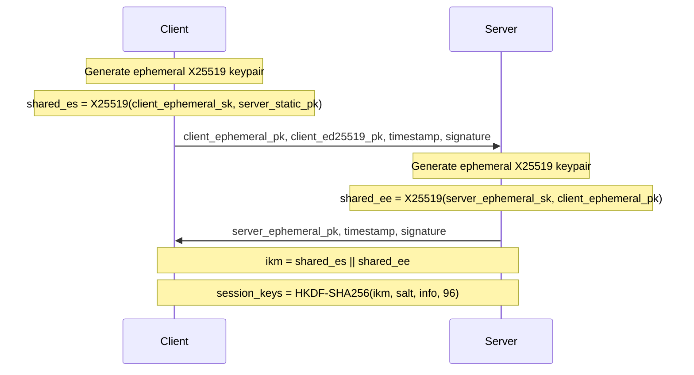

# StealthRelay

**A zero-knowledge WebSocket relay server for end-to-end encrypted peer connections by [Olib AI](https://www.olib.ai)**

Used in [StealthOS](https://www.stealthos.app) — The privacy-focused operating environment.

---

[](https://www.rust-lang.org)
[](https://ghcr.io/olib-ai/stealth-relay)
[](LICENSE)
[](https://github.com/Olib-AI/ConnectionPool)

## Overview

StealthRelay is a self-hosted Rust relay server that routes WebSocket messages between [ConnectionPool](https://github.com/Olib-AI/ConnectionPool) peers without ever seeing their content. All application data is end-to-end encrypted using a Noise NK handshake (dual X25519 DH) with ChaCha20-Poly1305 session ciphers — the server handles only opaque blobs.

The relay operates on a zero-knowledge model: deploy it on your own infrastructure, claim ownership via a one-time QR code, and invite friends through cryptographically signed invitation URLs. The server authenticates hosts with Ed25519 signatures and protects against abuse with adaptive proof-of-work, per-IP rate limiting, and progressive blocking.

Five Rust crates, `#![forbid(unsafe_code)]` on all of them, ~11,000 lines of code, 82 unit tests, 30 E2E tests, and 5 security audit laps with 30+ hardening fixes.

## How It Works



## Features

### Protocol Security

- **Noise NK handshake** — Dual X25519 Diffie-Hellman with HKDF-SHA256 key derivation for forward-secret session establishment
- **ChaCha20-Poly1305 session cipher** — Authenticated encryption for all application data with automatic symmetric ratchet at 2^20 messages
- **Ed25519 host authentication** — Domain-separated timestamp signatures verified by the relay before pool creation
- **HMAC invitation tokens** — 256-bit tokens with HKDF derivation and constant-time comparison; one-time use, time-limited, host approval required
- **Server claiming** — One-time 256-bit QR code visible only in Docker logs; rate-limited to 3 attempts with recovery key fallback
- **Session tokens** — 32-byte server-issued tokens required for all privileged host operations (constant-time comparison)
- **Display name sanitization** — Control characters, newlines, and excessive length (>64 chars) stripped before logging or storage

### Anti-Abuse

- **Adaptive proof-of-work** — SHA-256 hashcash with difficulty that scales from 18-bit (~50ms) to 26-bit (~13s) based on request rate
- **Per-IP rate limiting** — Connection rate, message rate, and failed authentication tracking with IPv6 /48 normalization
- **Progressive blocking** — IPs exceeding limits are blocked for configurable durations (default 10 minutes)
- **JSON depth bomb defense** — Recursive nesting in `SessionResumed` frames is structurally prevented by using flat `BufferedRelayedMessage` types
- **64 KB message cap** — Oversized WebSocket frames are rejected before processing

### Operations

- **Docker-first deployment** — Multi-stage build producing a minimal Debian image with no shell
- **Cloudflare Tunnel support** — Production deployment via `cloudflared` sidecar for TLS termination without managing certificates
- **Native TLS** — Optional `rustls` with SPKI SHA-256 pin verification for direct TLS termination
- **Recovery key** — One-time recovery key issued at claim time for server rebinding if the host device is lost
- **Graceful shutdown** — Signal handling with connection draining

### Observability

- **Structured logging** — JSON or pretty output via `tracing` with per-crate filter directives
- **Prometheus metrics** — Connection counts, pool counts, message rates exposed on a dedicated metrics port
- **Health endpoint** — JSON health status with built-in Docker `HEALTHCHECK`

## Architecture



## Security

Security is not bolted on — it is structural. Every layer enforces its own guarantees.

### Server Authentication (Ed25519)

The host authenticates to the relay by signing `pool_id || timestamp` with a Keychain-stored Ed25519 private key. The relay verifies the signature against the bound host public key before creating a pool. Timestamps are checked within a 5-minute skew window to prevent replay attacks.

### Invitation Tokens

Invitation tokens are 256-bit secrets derived via HKDF. The relay stores only the HMAC commitment — never the raw token. Tokens are:

- **One-time use** (or configurable `max_uses`)
- **Time-limited** (configurable `expires_in_secs`)
- **Host-approved** — the relay forwards join requests to the host for explicit approval
- **Ed25519-signed** — invitation URLs include a signature binding the token to the server address and pool ID

### Proof-of-Work

Joining peers must solve a SHA-256 hashcash challenge before their request is forwarded to the host. Difficulty scales adaptively:

| Requests/min | Difficulty | Expected Hashes | Solve Time |
|--------------|------------|-----------------|------------|
| 0-50         | 18 bits    | ~262k           | ~50ms      |
| 51-200       | 22 bits    | ~4M             | ~800ms     |
| 201+         | 26 bits    | ~67M            | ~13s       |

Challenges include a timestamp to prevent pre-computation and are verified within a time window.

### Rate Limiting

| Limit | Default | Scope |
|-------|---------|-------|
| Connection rate | 30/min | Per-IP (IPv6 /48 normalized) |
| Message rate | 60/sec | Per-connection |
| Failed auth | 5 attempts | Per-IP, then blocked |
| Block duration | 10 min | Per-IP |

### Session Tokens

After successful `HostAuth`, the server issues a 32-byte session token. All privileged operations require this token:

- `CreateInvitation`
- `RevokeInvitation`
- `JoinApproval`
- `KickPeer`
- `ClosePool`
- Host-originated `Forward`

Token comparison uses constant-time equality to prevent timing side-channels.

### Noise NK Handshake

The handshake follows the Noise NK pattern where the client knows the server's static X25519 public key (obtained via invitation or out-of-band):



This provides forward secrecy via ephemeral keys, server authentication via the static key (NK pattern), and client authentication via Ed25519 signature over the handshake transcript. All ephemeral secrets are zeroized after key derivation.

### Display Name Sanitization

All display names received from clients are sanitized before logging or storage: control characters and newlines are stripped, and length is truncated to 64 characters. This prevents log injection and terminal escape attacks.

### What the Relay Can and Cannot See

| Data | Visible to Relay? | Notes |
|------|-------------------|-------|
| Connected peer IDs | Yes | Required for routing |
| Peer IP addresses | Yes | Required for TCP connections |
| Message routing metadata | Yes | Who sends to whom, when, message type |
| Message sizes and timing | Yes | Inherent in transport |
| Pool membership | Yes | Required for pool management |
| **Message content** | **No** | E2E encrypted (ChaCha20-Poly1305) |
| **Chat text** | **No** | Inside encrypted payload |
| **Game moves** | **No** | Inside encrypted payload |
| **Shared files** | **No** | Inside encrypted payload |
| **Pool codes** | **No** | Only HMAC commitments stored |
| **Invitation secrets** | **No** | Only HMAC commitments stored |

### Container Hardening

- Non-root user (`stealthos`)
- Read-only filesystem
- All Linux capabilities dropped (`--cap-drop ALL`)
- No shell in the image
- `no-new-privileges` security option
- 256 MB memory limit
- tmpfs for `/tmp` with `noexec,nosuid`

## Quick Start

### 1. Deploy with Docker

```bash
docker run -d --name stealth-relay \
  -p 9090:9090 -p 127.0.0.1:9091:9091 \
  -v stealth-relay-keys:/var/stealth-relay/keys \
  -e STEALTH_SERVER__WS_BIND=0.0.0.0:9090 \
  -e STEALTH_SERVER__METRICS_BIND=0.0.0.0:9091 \
  --read-only --tmpfs /tmp:noexec,nosuid,size=16m \
  --security-opt no-new-privileges:true --cap-drop ALL \
  ghcr.io/olib-ai/stealth-relay:latest
```

### 2. Claim the Server

```bash
docker logs stealth-relay
```

You will see a one-time QR code:

```
╔══════════════════════════════════════════════════════════════╗
║              SERVER CLAIM REQUIRED                          ║
╠══════════════════════════════════════════════════════════════╣
║                                                              ║
║  Scan the QR code below with StealthOS to claim this         ║
║  server, or enter the code manually in the app.              ║
║                                                              ║
    █▀▀▀▀▀▀▀██▀▀▀█▀▀▀█▀██▀▀▀▀██▀█▀█▀▀▀▀▀▀▀█
    █ █▀▀▀█ ██▀▀ ▄█▀▄▀▀▄▄▄ █▄▄█▄█ █ █▀▀▀█ █
    ...
║                                                              ║
║  Manual code: xxxx-xxxx-xxxx-xxxx-xxxx-xxxx-xxxx             ║
╚══════════════════════════════════════════════════════════════╝
```

Open **StealthOS** → **Connection Pool** → **Host Remote Pool**:
- Enter your server URL (`ws://your-ip:9090`)
- Tap **Scan QR Code** (point camera at the terminal QR)
- Or type the manual code from the logs

The server is now bound to your device. A **recovery key** is shown once — **save it securely**. It is the only way to reclaim the server if you lose your device.

### 3. Create an Invitation in the App

Once claimed, tap **"Invite a Friend"** in the pool lobby. Share the generated link or QR code.

### 4. Share and Connect

When friends open the invitation:
- The server forwards their join request to you
- You approve or reject from your device
- Any connected member can also create invite links — but **you always approve**

Chat, play games, share files — all end-to-end encrypted. The server routes messages but can never read them.

## Deployment

### One-Click Deploy

Deploy StealthRelay to your preferred cloud provider:

| Provider | Deploy | Notes |
|----------|--------|-------|
| **Railway** | [](https://railway.com/template?referralCode=olib&template=https://github.com/Olib-AI/StealthRelay) | Persistent volume for keys, WebSocket native |
| **Render** | [](https://render.com/deploy?repo=https://github.com/Olib-AI/StealthRelay) | Free tier available, persistent disk |
| **DigitalOcean** | [](https://cloud.digitalocean.com/apps/new?repo=https://github.com/Olib-AI/StealthRelay/tree/main) | App Platform, auto-deploy on push |
| **Fly.io** | `fly launch --copy-config` | Global edge, persistent volume |

All providers terminate TLS at the edge — no certificate management needed.

### Docker Compose

The recommended self-hosted deployment method:

```bash
docker compose -f docker/docker-compose.yml up -d
docker compose -f docker/docker-compose.yml logs -f stealth-relay
```

This provides:
- Persistent key volume (`stealth-keys`)
- Read-only config bind-mount
- Security hardening (read-only FS, no capabilities, no new privileges)
- Resource limits (256 MB memory, 2 CPUs)
- Health checks every 30 seconds
- Log rotation (10 MB max, 3 files)

### Cloudflare Tunnel

For internet access without opening ports or managing TLS certificates:

```bash
# 1. Create a tunnel at https://one.dash.cloudflare.com → Networks → Tunnels
# 2. Set CLOUDFLARED_TOKEN in docker/.env
# 3. Deploy with the overlay compose file

docker compose -f docker/docker-compose.yml \
               -f docker/docker-compose.cloudflared.yml up -d
```

The overlay removes the public WebSocket port binding — all traffic flows through the tunnel. Your relay will be available at `wss://your-tunnel-hostname`.

### Native TLS

For direct TLS termination without Cloudflare, configure `rustls` with your certificate and key files. ConnectionPool clients support SPKI SHA-256 pin verification via a custom `URLSessionDelegate` for certificate pinning.

### Environment Variables

All configuration values can be overridden with environment variables using the `STEALTH_` prefix and double-underscore nesting:

| Environment Variable | Compose Variable | Description |
|---------------------|-----------------|-------------|
| `STEALTH_SERVER__WS_BIND` | — | WebSocket bind address |
| `STEALTH_SERVER__METRICS_BIND` | — | Metrics bind address |
| `STEALTH_LOGGING__LEVEL` | `STEALTH_LOG_LEVEL` | Log filter directive |
| `STEALTH_LOGGING__FORMAT` | `STEALTH_LOG_FORMAT` | Output format (`json` or `pretty`) |
| `STEALTH_CRYPTO__KEY_DIR` | — | Host identity key directory |
| — | `STEALTH_WS_PORT` | Host-side WebSocket port mapping |
| — | `STEALTH_METRICS_PORT` | Host-side metrics port mapping |
| — | `CLOUDFLARED_TOKEN` | Cloudflare Tunnel token |

## Configuration

Config precedence: **environment variables** (`STEALTH_` prefix) > **TOML file** > **defaults**.

See [`config/default.toml`](config/default.toml) for the annotated configuration file.

### Server

| Setting | Default | Description |
|---------|---------|-------------|
| `server.ws_bind` | `0.0.0.0:9090` | Address the WebSocket listener binds to |
| `server.metrics_bind` | `127.0.0.1:9091` | Address for the internal health/metrics HTTP endpoint |
| `server.max_connections` | `500` | Maximum number of concurrent WebSocket connections |
| `server.max_message_size` | `65536` | Maximum size of a single WebSocket message in bytes (64 KiB) |
| `server.idle_timeout` | `600` | Seconds of inactivity before a connection is closed (10 min) |
| `server.handshake_timeout` | `10` | Seconds allowed for a client to complete the WebSocket handshake |

### Pool

| Setting | Default | Description |
|---------|---------|-------------|
| `pool.max_pools` | `100` | Maximum number of active pools on this relay |
| `pool.max_pool_size` | `16` | Maximum peers allowed in a single pool |
| `pool.pool_idle_timeout` | `300` | Seconds of pool inactivity before automatic cleanup (5 min) |

### Crypto

| Setting | Default | Description |
|---------|---------|-------------|
| `crypto.key_dir` | `/var/stealth-relay/keys` | Directory for host identity key files (Ed25519 seed + X25519 static key) |
| `crypto.auto_generate_keys` | `true` | Automatically generate a host keypair on first start if none exists |

### Logging

| Setting | Default | Description |
|---------|---------|-------------|
| `logging.level` | `info` | Tracing filter directive (e.g., `info`, `stealthos_server=debug`, `stealthos_server=trace,tower=warn`) |
| `logging.format` | `json` | Output format: `json` for production (log aggregators), `pretty` for development |

### Rate Limiting

| Setting | Default | Description |
|---------|---------|-------------|
| `rate_limit.connections_per_minute` | `30` | Maximum new connections per IP per minute |
| `rate_limit.messages_per_second` | `60` | Maximum messages per connection per second |
| `rate_limit.max_failed_auth` | `5` | Maximum failed authentication attempts per IP before temporary block |
| `rate_limit.block_duration_secs` | `600` | Duration in seconds an IP stays blocked after exceeding limits (10 min) |

## API Reference

### Client → Server Frames

All frames are JSON-encoded with an internally-tagged `frame_type` discriminator.

| Frame | Fields | Description |
|-------|--------|-------------|
| `host_auth` | `host_public_key`, `timestamp`, `signature`, `pool_id`, `server_url?`, `display_name?` | Authenticate as the pool host with Ed25519 signature |
| `join_request` | `token_id`, `proof`, `timestamp`, `nonce`, `client_public_key`, `display_name`, `pow_solution?` | Request to join a pool with an invitation token |
| `forward` | `data`, `target_peer_ids?`, `sequence`, `session_token?` | Forward opaque E2E encrypted data to peer(s) |
| `create_invitation` | `max_uses`, `expires_in_secs`, `session_token?` | Host creates an invitation token |
| `revoke_invitation` | `token_id`, `session_token?` | Host revokes an existing invitation |
| `join_approval` | `client_public_key`, `approved`, `reason?`, `session_token?` | Host approves or rejects a pending join request |
| `kick_peer` | `peer_id`, `reason`, `session_token?` | Host kicks a peer from the pool |
| `close_pool` | `session_token?` | Host closes the pool |
| `handshake_init` | `client_ephemeral_pk`, `client_identity_pk`, `timestamp`, `signature` | Noise NK handshake step 1 |
| `claim_server` | `claim_secret`, `host_public_key`, `display_name` | Claim an unclaimed server |
| `reclaim_server` | `recovery_key`, `new_host_public_key`, `display_name` | Reclaim a server using the recovery key |
| `ack` | `sequence` | Acknowledge receipt of a sequence number |
| `heartbeat_ping` | `timestamp` | Client heartbeat |

### Server → Client Frames

| Frame | Fields | Description |
|-------|--------|-------------|
| `server_hello` | `server_ephemeral_pk`, `server_identity_pk`, `pow_challenge?`, `timestamp`, `signature` | Noise NK handshake step 2 with optional PoW challenge |
| `host_auth_success` | `pool_id`, `session_token` | Pool created, session token issued |
| `join_accepted` | `session_token`, `peer_id`, `peers[]`, `pool_info` | Join approved with current pool state |
| `join_rejected` | `reason` | Join request denied |
| `join_request_for_host` | `client_public_key`, `token_id`, `proof`, `timestamp`, `nonce`, `display_name` | Forwarded join request for host approval |
| `invitation_created` | `token_id`, `url`, `expires_at` | Invitation token generated |
| `peer_joined` | `peer` | A new peer joined the pool |
| `peer_left` | `peer_id`, `reason` | A peer left the pool |
| `relayed` | `data`, `from_peer_id`, `sequence` | Relayed E2E encrypted data from another peer |
| `session_resumed` | `missed_messages[]`, `last_acked_sequence` | Reconnection with buffered messages |
| `claim_success` | `server_fingerprint`, `message`, `recovery_key` | Server claimed successfully |
| `claim_rejected` | `reason` | Claim attempt rejected |
| `error` | `code`, `message` | Error response |
| `kicked` | `reason` | Server-initiated kick |
| `heartbeat_pong` | `timestamp`, `server_time` | Server heartbeat response |

### Error Codes

| Code | Meaning |
|------|---------|
| `400` | Bad request — malformed frame, invalid parameters, or missing required fields |
| `401` | Unauthorized — invalid signature, expired timestamp, or invalid session token |
| `403` | Forbidden — server already claimed, peer not authorized, or operation not permitted |
| `404` | Not found — pool or invitation does not exist |
| `428` | Precondition required — server is unclaimed, send `claim_server` first |
| `429` | Rate limited — too many requests, retry after backoff |
| `503` | Service unavailable — max pools reached, pool full, or server is shutting down |

### HTTP Endpoints

| Endpoint | Port | Description |
|----------|------|-------------|
| `ws://host:9090/` | 9090 | WebSocket relay (client connections) |
| `GET /health` | 9091 | JSON health status |
| `GET /metrics` | 9091 | Prometheus metrics |

## Project Structure

```
StealthRelay/
├── Cargo.toml                         # Workspace manifest (Rust 2024 edition)
├── Cargo.lock
├── Dockerfile                         # Multi-stage build (Debian bookworm)
├── config/
│   └── default.toml                   # Annotated default configuration
├── docker/
│   ├── docker-compose.yml             # Base deployment
│   └── docker-compose.cloudflared.yml # Cloudflare Tunnel overlay
├── crates/
│   ├── stealthos-server/              # CLI, config, handler, claim flow
│   │   ├── src/
│   │   │   ├── main.rs                # clap CLI, tokio runtime, signal handling
│   │   │   ├── app.rs                 # AppState shared across connections
│   │   │   ├── config.rs              # TOML + env config loading
│   │   │   ├── handler.rs             # WebSocket message dispatch
│   │   │   └── claim.rs               # Server claim/reclaim logic
│   │   └── tests/
│   │       └── integration.rs         # Integration tests
│   ├── stealthos-core/                # Pool registry, routing, types
│   │   └── src/
│   │       ├── server_frame.rs        # All client/server frame types
│   │       ├── pool_registry.rs       # Pool lifecycle management
│   │       ├── pool.rs                # Single pool state
│   │       ├── router.rs              # Message routing
│   │       ├── ratelimit.rs           # Per-IP and per-connection rate limiting
│   │       ├── message.rs             # Message types
│   │       ├── types.rs               # PeerId, PoolId type aliases
│   │       └── error.rs               # PoolError, RateLimitError
│   ├── stealthos-crypto/              # Cryptographic primitives
│   │   └── src/
│   │       ├── identity.rs            # Ed25519 host identity
│   │       ├── peer_identity.rs       # Peer identity verification
│   │       ├── handshake.rs           # Noise NK key exchange
│   │       ├── envelope.rs            # Encrypted envelope handling
│   │       ├── invitation.rs          # Invitation token HKDF/HMAC
│   │       ├── pow.rs                 # Proof-of-work challenge/verify
│   │       └── error.rs               # CryptoError types
│   ├── stealthos-transport/           # WebSocket server, TLS
│   │   └── src/
│   │       ├── server.rs              # Transport server
│   │       ├── listener.rs            # TCP/TLS listener
│   │       ├── connection.rs          # WebSocket connection actor
│   │       ├── connection_registry.rs # Connection tracking
│   │       ├── config.rs              # Transport configuration
│   │       ├── types.rs               # Transport types
│   │       └── error.rs               # Transport errors
│   └── stealthos-observability/       # Logging, metrics, health
│       └── src/
│           ├── logging.rs             # tracing + tracing-subscriber setup
│           ├── metrics.rs             # Prometheus metrics exporter
│           └── health.rs              # /health and /metrics HTTP handlers
└── scripts/
    └── e2e-test.sh                    # End-to-end test runner
```

## Development

```bash
# Build the workspace
cargo build --workspace

# Run all tests (82 unit tests)
cargo test --workspace

# Lint
cargo clippy --workspace -- -D warnings

# Format check
cargo fmt --all -- --check

# Run locally with pretty logging
STEALTH_CRYPTO__KEY_DIR=/tmp/stealth-keys \
STEALTH_LOGGING__FORMAT=pretty \
cargo run -p stealthos-server -- serve

# E2E test against a running server
./scripts/e2e-test.sh ws://localhost:9090

# Docker build
docker build -t stealth-relay .
```

## Recovery

If you lose access to your device:

1. Enter the **recovery key** (shown once at claim time) in the app
2. The server rebinds to your new device's key
3. A **new recovery key** is issued (the old one is invalidated)

If you lose the recovery key too, you must redeploy with a fresh key volume:

```bash
docker volume rm stealth-relay-keys
docker restart stealth-relay
```

## Requirements

- **Docker 24+** and **Compose v2.4+** (for deployment)
- **Rust 1.87+** with 2024 edition support (for building from source)
- **Platforms**: amd64, arm64

## License

MIT License

Copyright (c) 2025 Olib AI

Permission is hereby granted, free of charge, to any person obtaining a copy
of this software and associated documentation files (the "Software"), to deal
in the Software without restriction, including without limitation the rights
to use, copy, modify, merge, publish, distribute, sublicense, and/or sell
copies of the Software, and to permit persons to whom the Software is
furnished to do so, subject to the following conditions:

The above copyright notice and this permission notice shall be included in all
copies or substantial portions of the Software.

THE SOFTWARE IS PROVIDED "AS IS", WITHOUT WARRANTY OF ANY KIND, EXPRESS OR
IMPLIED, INCLUDING BUT NOT LIMITED TO THE WARRANTIES OF MERCHANTABILITY,
FITNESS FOR A PARTICULAR PURPOSE AND NONINFRINGEMENT. IN NO EVENT SHALL THE
AUTHORS OR COPYRIGHT HOLDERS BE LIABLE FOR ANY CLAIM, DAMAGES OR OTHER
LIABILITY, WHETHER IN AN ACTION OF CONTRACT, TORT OR OTHERWISE, ARISING FROM,
OUT OF OR IN CONNECTION WITH THE SOFTWARE OR THE USE OR OTHER DEALINGS IN THE
SOFTWARE.

## Credits

- [Olib AI](https://www.olib.ai) — Project maintainer and [StealthOS](https://www.stealthos.app) developer
- [ConnectionPool](https://github.com/Olib-AI/ConnectionPool) — Swift P2P mesh networking client library
- [PoolChat](https://github.com/Olib-AI/PoolChat) — End-to-end encrypted chat built on ConnectionPool

## Contributing

Contributions are welcome! Please ensure:

1. All code compiles with `#![forbid(unsafe_code)]`
2. `cargo clippy --workspace -- -D warnings` passes with no warnings
3. `cargo fmt --all -- --check` produces no diffs
4. All public APIs are documented with `///` doc comments
5. New features include unit tests
6. No new dependencies without discussion in an issue first

## Security

If you discover a security vulnerability, please report it privately to [security@olib.ai](mailto:security@olib.ai) rather than opening a public issue.
